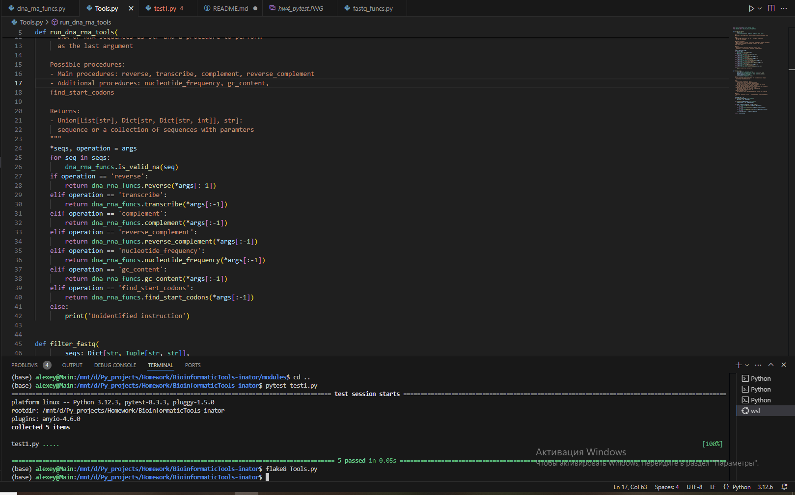

## **BioinformaticTools-inator**
 BioinformaticTools-inator is a toolkit for working with DNA and RNA sequences and filtering fastq sequences. This toolkit includes functions such as `run_dna_rna_tools` and `filter_fastq`.
 
### Installation
- To run BioinformaticTools-inator you need to have Python installed
- Get the code:
```
git clone git@github.com:AlexeyChutko/BioinformaticTools-inator.git
git branch -all
git checkout hw4
```

### Usage
1. **run_dna_rna_tools**  
This toolkit works with DNA and RNA sequences by performing operations such as:  
1. `transcribe`: Transcribes a DNA sequence to RNA (replaces thymine 'T' with uracil 'U').
2. `complement`: Generates the complement of a DNA or RNA sequence.
3. `reverse`:  Reverses the input sequence(s).
4. `reverse_complement`: Generates the reverse complement of a DNA or RNA sequence.
5. `nucleotide_frequency`: Computes the nucleotide frequency (A, T/U, G, C) for each input sequence.
6. `gc_content`: Calculates the GC-content (percentage of G and C nucleotides) of each input sequence.
7. `find_start_codons`: Identifies the positions of start codons (AUG for RNA, ATG for DNA) in each sequence.  

Example:
```
from Tools import run_dna_rna_tools
sequences = 'ATG'
procedure = 'transcribe'
print(run_dna_rna_tools(sequences, procedure))
```
2. **filter_fastq**  
This utile filters fastq sequences with their length, GC composition and quality (based on phred33)  
Filtering Criteria  
1. `gc_bounds`: length boundaries within which filtered sequences must be included.
2. `length_bounds`: GC-content boundaries (from 0 to 100) within which filtered sequences must be included.
3. `quality_threshold`: sequence quality value according toc phred33, below which filtering will not be performed.

Example:
```
from Tools import filter_fastq
seqs = {'@SRX079873': ('ACAGCA', 'FGGGFG'), '@SRX079817': ('ATTAGC', 'BFFFFF), '@SRX079858': ('ATGACCCG', 'DCD@@BBC')}
gc_bounds = (20, 80)
length_bounds = (30, 70)
quality_threshold = 90
print(filter_fastq(seqs, gc_bounds, length_bounds, quality_threshold))
```

### Test screenshots

